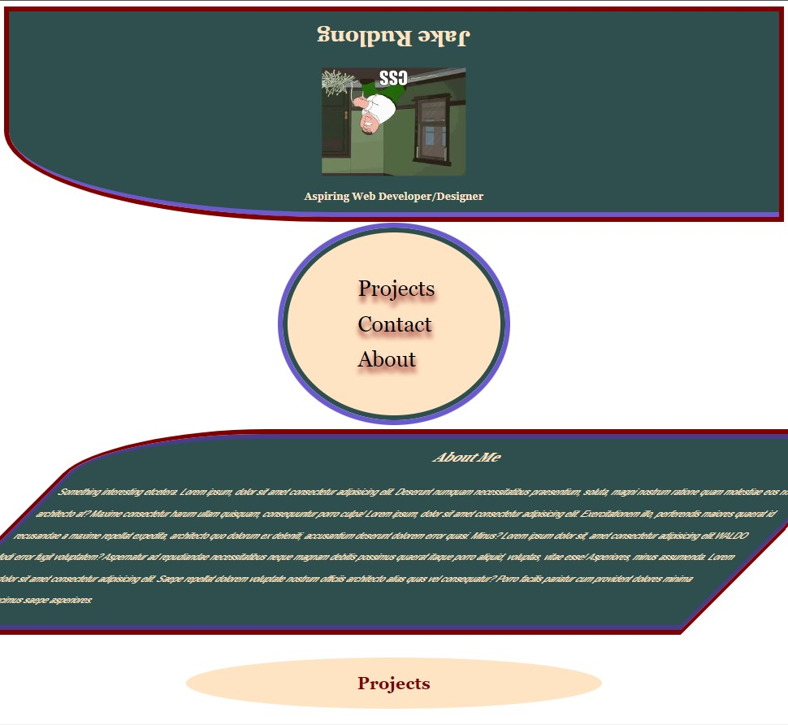

## Module 2 Challenge (Columbia Bootcamp)
  
# Description
This page is a challenge project using flexbox/CSS knowledge learned in class to create a responsive personal portfolio website with the following acceptance criteria:
GIVEN I need to sample a potential employee's previous work
- WHEN I load their portfolio THEN I am presented with the developer's name, a recent photo or avatar, and links to sections about them, their work, and how to contact them
- WHEN I click one of the links in the navigation THEN the UI scrolls to the corresponding section
- WHEN I click on the link to the section about their work THEN the UI scrolls to a section with titled images of the developer's applications
- WHEN I am presented with the developer's first application THEN that application's image should be larger in size than the others
- WHEN I click on the images of the applications THEN I am taken to that deployed application
- WHEN I resize the page or view the site on various screens and devices THEN I am presented with a responsive layout that adapts to my viewport 
The deployed page is: https://jdr8888.github.io/project-02/"
The github repo is https://github.com/JDR8888/project-02

Screenshot of the page:

# Installation
N/A
# Usage
N/A
# Credits
giphy.com; forthebadge.com; Columbia U;
# License
Please see the repo for license info